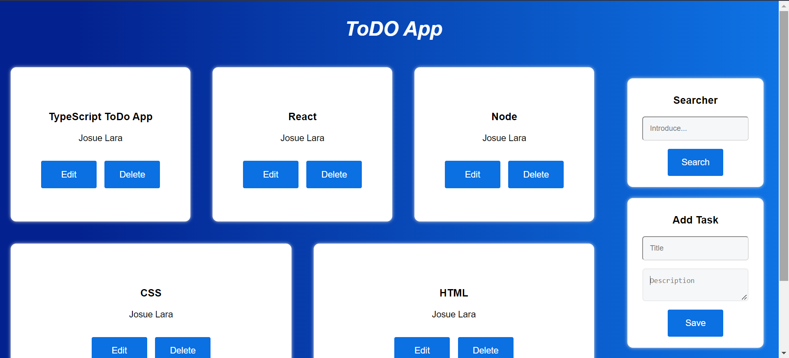
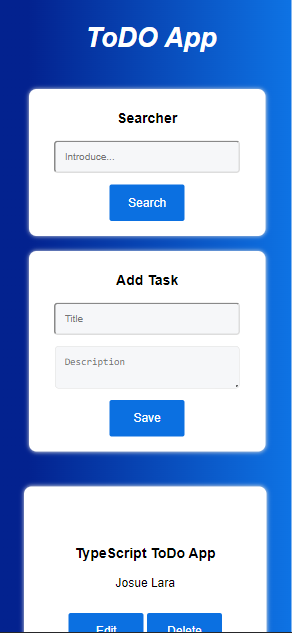

# ToDo Ts App

ToDo list saved it in localStorage and made it with vanilla TypeScript.

Includes:

1.  Page that allows create, delete and update tasks.
2.  Searcher to find a particular task.
3.  Responsive design

# Deployment

NETLIFY:

[LINK](https://todo-app-ts-josue-lara.netlify.app/)

## Screenshots

Desktop version:

Mobile version:

## Languages, libraries and tools

1.  [HTML](https://developer.mozilla.org/en-US/docs/Web/HTML)
2.  [CSS](https://developer.mozilla.org/en-US/docs/Web/CSS)
3.  [TypeScript](https://www.typescriptlang.org/)

## Install and run project

1. Clone repo.
2. Install live server.
3. To make changes, install [TypeScript](https://www.typescriptlang.org/) and run `tsc -w`
4. Open with live server.
